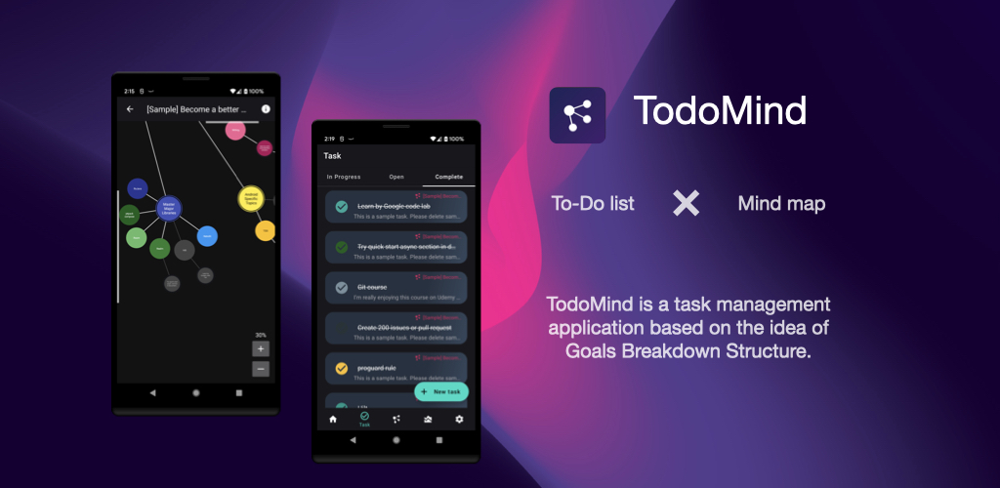
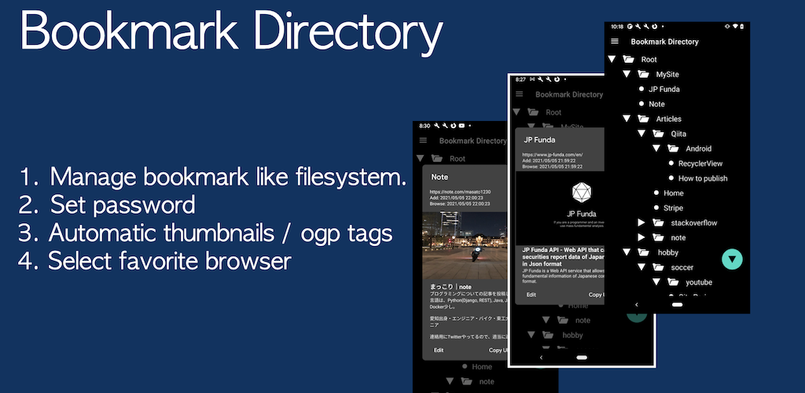

### Things I code with
Android

iOS & Web & Other

<!-- Stats section -->
## Github Stats

## Udemy Course

## Personal Development

<table>
  <thead align="center">
    <tr border: none;>
      <td><b>🎁 Projects</b></td>
      <td><b>Platform</b></td>
      <td><b>Pull Requests</b></td>
      <td><b>Feature</b></td>
      <td><b>Site/Store Link</b></td>
    </tr>
  </thead>
  <tbody>
  <tr>
      <td><a href="https://github.com/masato1230/BoxifulAndroid"><b>Boxiful(Android)</b></a></td>
      <td></td>
      <td></td>
      <td></td>
      <td>under construction</td>
    </tr>
    <tr>
      <td><a href="https://github.com/masato1230/TodoMind"><b>TodoMind</b></a></td>
      <td></td>
      <td></td>
      <td></td>
      <td><a href='https://play.google.com/store/apps/details?id=com.jp_funda.todomind&pcampaignid=pcampaignidMKT-Other-global-all-co-prtnr-py-PartBadge-Mar2515-1'></td>
    </tr>
	  <tr>
      <td><a href="https://github.com/masato1230/Boxiful"><b>Boxiful(Web)</b></a></td>
      <td></td>
      <td>backend repo is private mode</td>
      <td></td>
      <td><a href="https://boxiful.jp/">web site</a></td>
    </tr>
    <tr>
      <td><a href="https://github.com/masato1230/URLFolder"><b>Bookmark Directory</b></a></td>
      <td></td>
      <td></td>
      <td></td>
      <td></td>
    </tr>
    <tr>
      <td><a href="https://github.com/thmsgbrt/nodejs-typescript-express-apollo-graphql-starter"><b>JP Funda</b></a></td>
      <td></td>
      <td>private repo</td>
      <td></td>
      <td><a href='https://www.jp-funda.com'>web site</a></td>
    </tr>
  </tbody>
</table>
